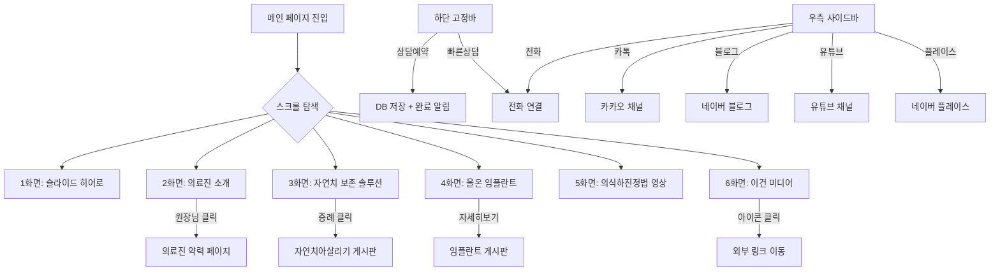
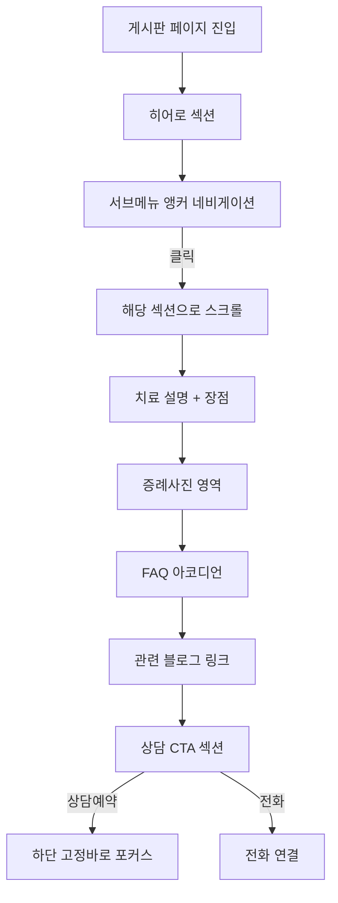

# 서울이건치과 홈페이지 사용자 플로우

## 1. 메인 플로우 (환자)



## 2. 게시판 플로우 (환자)



## 3. 화면별 플로우

### 메인 페이지
| 화면 | 진입 | 사용자 행동 | 이탈 |
|------|------|-----------|------|
| 1화면 히어로 | URL 직접 진입 | 슬라이드 감상, 인디케이터 클릭 | 스크롤 다운 |
| 2화면 의료진 | 스크롤 | 원장님 호버 → 클릭 | 약력 페이지 이동 |
| 3화면 보존솔루션 | 스크롤 | B/A 호버로 설명 확인 → 클릭 | 게시판 이동 |
| 4화면 임플란트 | 스크롤 | 보철물 감상 → 자세히보기 클릭 | 게시판 이동 |
| 5화면 진정법 | 스크롤 | 영상 재생, 카운팅 숫자 확인 | 스크롤 다운 |
| 6화면 미디어 | 스크롤 | 외부 링크 아이콘 클릭 | 외부 이동 |

### 게시판 페이지 (공통)
| 섹션 | 진입 | 사용자 행동 | 이탈 |
|------|------|-----------|------|
| 히어로 | 메인/GNB에서 이동 | 대표 이미지 확인 | 스크롤 |
| 서브메뉴 | 스크롤 | 원하는 항목 클릭 → 앵커 이동 | 해당 섹션 |
| 치료 설명 | 앵커/스크롤 | 텍스트 + 이미지 확인 | 스크롤 |
| 증례사진 | 스크롤 | B/A 사진 확인 | 스크롤 |
| FAQ | 스크롤 | 아코디언 클릭으로 답변 확인 | 스크롤 |
| CTA | 스크롤 | 상담예약/전화 클릭 | 상담 전환 |

### 관리자 페이지
| 화면 | 진입 | 사용자 행동 | 이탈 |
|------|------|-----------|------|
| 로그인 | /admin 접근 | 비밀번호 입력 | 대시보드 |
| 대시보드 | 로그인 성공 | 메뉴 선택 | 각 관리 페이지 |
| 상담 DB | 대시보드 | 신청 목록 확인/삭제 | 대시보드 |
| 증례 관리 | 대시보드 | 사진 업로드/글 수정/삭제 | 대시보드 |
| 공지사항 | 대시보드 | 공지 작성/수정/삭제 | 대시보드 |

## 4. 예외 플로우

| 상황 | 처리 |
|------|------|
| 상담 신청 시 개인정보 미동의 | "개인정보 수집에 동의해주세요" alert |
| 상담 신청 시 빈 필드 | "이름과 연락처를 입력해주세요" alert |
| 관리자 로그인 실패 | "비밀번호가 틀렸습니다" 에러 표시 |
| 이미지 업로드 실패 | "파일 업로드에 실패했습니다" 에러 + 재시도 |
| 네트워크 에러 | "네트워크 오류가 발생했습니다" toast |

## 5. 글로벌 네비게이션

### 고정 헤더 (모든 페이지)
```
[서울대로고 + SEOUL EGUN DENTAL]                    [햄버거 메뉴]
```

### 햄버거 메뉴 펼침
```
1. 이건치과소개
2. 자연치아살리기
3. 임플란트
4. 심미보철
5. 서울이건 교정치료
6. 소아치과 치료
7. 이건 미디어
```

### 커스텀 커서
- 서울대 로고가 마우스를 따라다님 (데스크톱 전용)
