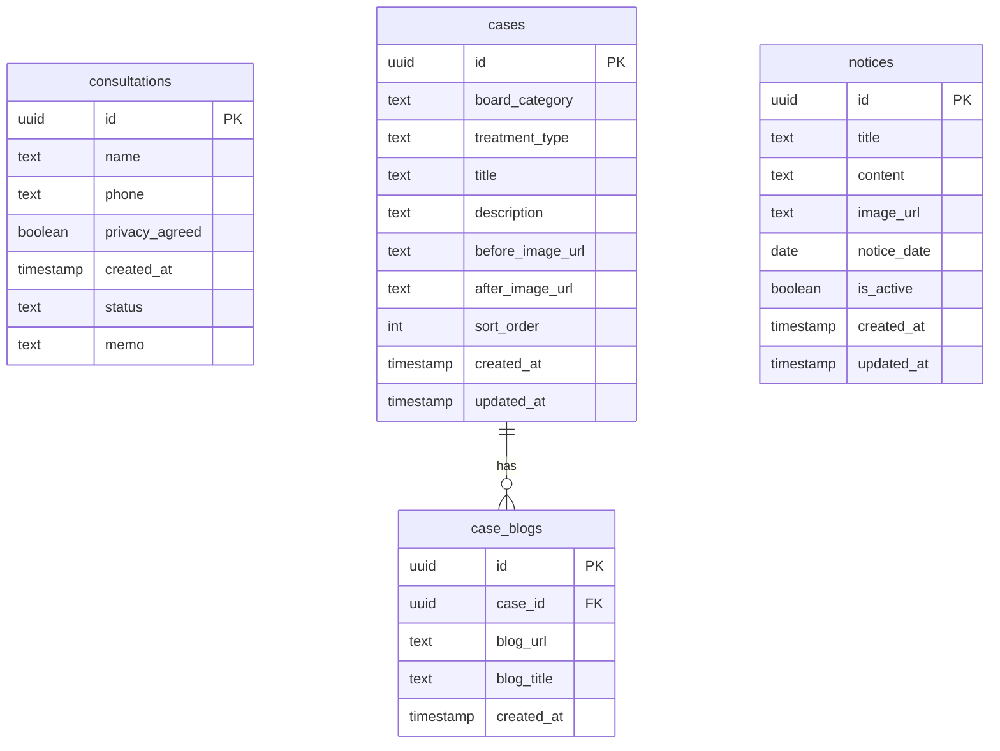

# 서울이건치과 홈페이지 데이터베이스 설계

## 1. ERD



## 2. 테이블 정의

### consultations (상담 신청)
| 컬럼 | 타입 | 제약 | 설명 |
|------|------|------|------|
| id | uuid | PK, DEFAULT gen_random_uuid() | 기본키 |
| name | text | NOT NULL | 환자 이름 |
| phone | text | NOT NULL | 연락처 |
| privacy_agreed | boolean | NOT NULL, DEFAULT true | 개인정보 동의 |
| status | text | DEFAULT 'pending' | 상태 (pending/contacted/completed) |
| memo | text | NULL | 관리자 메모 |
| created_at | timestamptz | DEFAULT now() | 신청 일시 |

### cases (증례 사진/글)
| 컬럼 | 타입 | 제약 | 설명 |
|------|------|------|------|
| id | uuid | PK, DEFAULT gen_random_uuid() | 기본키 |
| board_category | text | NOT NULL | 게시판 카테고리 (natural-tooth, implant, cosmetic, orthodontics, pediatric) |
| treatment_type | text | NOT NULL | 치료 유형 (cavity, vpt, root-canal 등) |
| title | text | NOT NULL | 증례 제목 |
| description | text | NULL | 증례 설명 |
| before_image_url | text | NULL | 비포 이미지 URL |
| after_image_url | text | NULL | 애프터 이미지 URL |
| sort_order | int | DEFAULT 0 | 정렬 순서 |
| created_at | timestamptz | DEFAULT now() | 생성일 |
| updated_at | timestamptz | DEFAULT now() | 수정일 |

### notices (공지사항/휴무일정)
| 컬럼 | 타입 | 제약 | 설명 |
|------|------|------|------|
| id | uuid | PK, DEFAULT gen_random_uuid() | 기본키 |
| title | text | NOT NULL | 공지 제목 |
| content | text | NULL | 공지 내용 |
| image_url | text | NULL | 첨부 이미지 URL |
| notice_date | date | NULL | 공지 날짜 (휴무일 등) |
| is_active | boolean | DEFAULT true | 활성 여부 |
| created_at | timestamptz | DEFAULT now() | 생성일 |
| updated_at | timestamptz | DEFAULT now() | 수정일 |

### case_blogs (증례 관련 블로그 링크)
| 컬럼 | 타입 | 제약 | 설명 |
|------|------|------|------|
| id | uuid | PK, DEFAULT gen_random_uuid() | 기본키 |
| case_id | uuid | FK → cases.id, ON DELETE CASCADE | 연결된 증례 |
| blog_url | text | NOT NULL | 블로그 URL |
| blog_title | text | NULL | 블로그 글 제목 |
| created_at | timestamptz | DEFAULT now() | 생성일 |

## 3. 인덱스

```sql
-- 상담 신청: 최신순 조회
CREATE INDEX idx_consultations_created_at ON consultations(created_at DESC);

-- 상담 신청: 상태별 필터
CREATE INDEX idx_consultations_status ON consultations(status);

-- 증례: 게시판별 조회
CREATE INDEX idx_cases_board_category ON cases(board_category);

-- 증례: 치료유형별 조회
CREATE INDEX idx_cases_treatment_type ON cases(treatment_type);

-- 증례: 정렬순서
CREATE INDEX idx_cases_sort_order ON cases(board_category, sort_order);

-- 공지사항: 활성 공지 조회
CREATE INDEX idx_notices_active ON notices(is_active, notice_date DESC);

-- 블로그 링크: 증례별 조회
CREATE INDEX idx_case_blogs_case_id ON case_blogs(case_id);
```

## 4. RLS (Row Level Security) 정책

```sql
-- consultations: 관리자만 조회/수정, 익명 사용자는 INSERT만
ALTER TABLE consultations ENABLE ROW LEVEL SECURITY;

CREATE POLICY "Anyone can insert consultation"
  ON consultations FOR INSERT
  WITH CHECK (true);

CREATE POLICY "Only admin can read consultations"
  ON consultations FOR SELECT
  USING (auth.role() = 'authenticated');

-- cases: 누구나 읽기, 관리자만 수정
ALTER TABLE cases ENABLE ROW LEVEL SECURITY;

CREATE POLICY "Anyone can read cases"
  ON cases FOR SELECT
  USING (true);

CREATE POLICY "Only admin can modify cases"
  ON cases FOR INSERT
  USING (auth.role() = 'authenticated');

-- notices: 활성 공지는 누구나 읽기, 관리자만 수정
ALTER TABLE notices ENABLE ROW LEVEL SECURITY;

CREATE POLICY "Anyone can read active notices"
  ON notices FOR SELECT
  USING (is_active = true OR auth.role() = 'authenticated');
```

## 5. Supabase Storage 버킷

| 버킷 | 용도 | 접근 |
|------|------|------|
| cases | 증례 사진 (before/after) | 공개 읽기, 관리자만 업로드 |
| notices | 공지사항 이미지 | 공개 읽기, 관리자만 업로드 |
| clinic | 치과 내부 사진, 의료진 사진 등 | 공개 읽기, 관리자만 업로드 |

## 6. board_category 매핑

| 값 | 게시판 |
|----|--------|
| natural-tooth | 자연치아살리기 |
| implant | 임플란트 |
| cosmetic | 심미보철 |
| orthodontics | 교정치료 |
| pediatric | 소아치과 |

## 7. treatment_type 매핑

| board_category | treatment_type | 한글명 |
|----------------|---------------|--------|
| natural-tooth | cavity | 충치치료 |
| natural-tooth | vpt | VPT 신경보존술 |
| natural-tooth | root-canal | 근관치료 |
| natural-tooth | gum | 잇몸치료 |
| implant | all-on | 올온 임플란트 |
| implant | immediate | 즉시로딩 임플란트 |
| implant | navigation | 네비게이션 임플란트 |
| implant | anterior | 전치부 임플란트 |
| implant | prp | 자가혈 임플란트 |
| implant | sinus-lift | 상악동 거상술 |
| implant | senior | 시니어 임플란트 |
| implant | diabetes | 당뇨 환자 임플란트 |
| cosmetic | laminate | 최소삭제 라미네이트 |
| cosmetic | resin-buildup | 앞니 레진빌드업 |
| cosmetic | gum-contouring | 잇몸성형술 |
| orthodontics | invisalign | 인비절라인 투명교정 |
| orthodontics | growth | 소아성장기교정 |
| pediatric | pediatric-cavity | 소아충치치료 |
| pediatric | laughing-gas | 웃음가스치료 |
